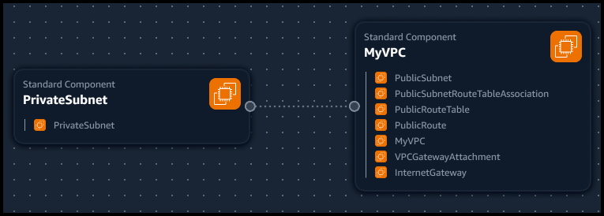
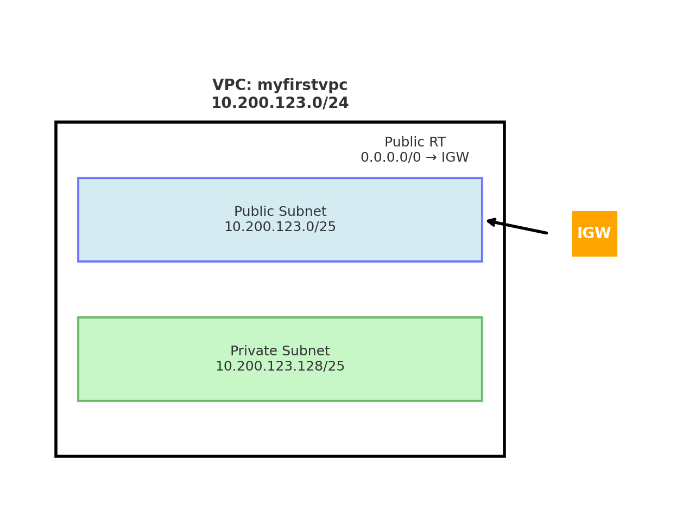

## VPC Settings
VPC IPv4 CIRR Block: 10.200.123.0/24

These are the VPC settings recommended by our instructor for use in the AWS Cloud environment:

- VPC Name: myfirstvpc
- IPv6 CIDR Block: No
- Number of AZs: 1
- Number of private subnets: 1
- Number of public subnets: 1
- NAT Gateways: none
- VPC endpoints: none
- DNS Options: Enable DNS hostnames
- DNS Options: Enable DNS resolution

## Generated and Reviewed CFN Template

I used these settings from the instructors video and asked the LLM to provide a cfn template I could use to automate the creation process of the VPC infrastructure. I used this yaml file to produce the two visualizations. I then requested that the code be refactored to provide a more generic template with parameters.

## Generated Deploy Script

Used LLM to generate bash deploy script and corresponding json parameters file.

## Visualization of Network Using AWS Infrastructure Composer

## Visualization of Network using Matplotlib in ChatCPT

## Installing AWS CLI

Installed the AWS CLI to establish identity and test deployment.
Instructions: https://docs.aws.amazon.com/cli/latest/userguide/getting-started-install.html

Verified installation at the command line with aws --version
Set up credentials for AWS account.

